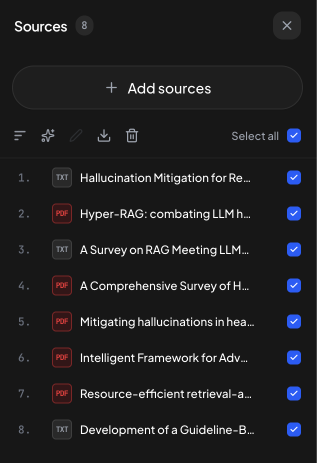

# NotbookLM

An open-source academic research assistant and document workspace designed to run locally on your own machine. Inspired by tools like Google Notebook (previously NotebookLM), Consensus, and Elicit, NotbookLM bridges conversational AI with verifiable academic literature synthesis.


Instead of relying on proprietary cloud lock-in, NotbookLM operates locally by default—combining embedded relational storage (SQLite), in-process vector indexing (Qdrant), and local file processing. It autonomously retrieves, filters, and synthesizes scholarly publications from global academic repositories—including **OpenAlex**, **Crossref**, **arXiv**, **Unpaywall**, and scholarly web fallbacks—delivering structured comparative matrices and grounded citations linked directly to source manuscripts.

Internet connectivity is utilized for live academic searches, external LLM APIs, and optional cloud services (Cloudflare R2, Doppler). However, the workspace can also run completely offline for self-uploaded documents when paired with a local model engine (such as Ollama) and the built-in local embedding model.

### Highlights

* **Automated Literature Discovery:** Queries global academic registries (OpenAlex, Crossref, and web fallbacks) with iterative candidate pool retrieval, language-aware filtering, and DOI/title deduplication.
* **Authentic PDF & Metadata Resolution:** Locates and downloads open-access PDFs via concurrent resolvers (arXiv, Unpaywall, OpenAlex) while enriching paper records with journal quartiles and citation counts.
* **Grounded Synthesis & Matrix Tables:** Produces comparative literature review matrices with cell-level citation tagging, mitigating hallucinations by grounding claims directly in retrieved excerpts.
* **Interactive Document Reader:** Split-pane interface featuring bidirectional citation navigation—click any citation badge to jump to and highlight the exact passage in the source PDF or document.
* **Local-First with Modular Scale:** Runs on a personal workstation with zero required cloud accounts. Operates offline for uploaded documents and local LLMs, while supporting live academic discovery, S3 storage (Cloudflare R2, MinIO), and Doppler secret management when online.

---

## Workflow & Core Capabilities

### 1. Literature Discovery & Candidate Acquisition
Search across OpenAlex, Crossref, and academic sources. NotbookLM filters candidates based on relevance rubrics and presents actionable cards containing titles, publication years, DOI links, and abstract previews. Users can select and batch-import papers directly into the workspace.


### 2. Intelligent Source Management & Dual Ingestion
Imported papers appear in the right-hand **Sources** panel with permanent numeric citation indices (`1.`, `2.`, ...):
* **`PDF` badge:** The authentic, open-access full-text manuscript was successfully discovered and downloaded via concurrent resolvers (arXiv, Unpaywall, OpenAlex).
* **`TXT` badge:** Full-text PDF was behind paywalls or unavailable; NotbookLM gracefully acquired and indexed verified metadata and abstracts to maintain comprehensive coverage.



### 3. Integrated Document & PDF Viewer
Inspect full manuscripts without leaving the workspace. The built-in document reader renders original publications—including multi-column formatting, figures, and publication venues (such as *Nature Communications*)—alongside structured plain-text extracts.


### 4. Grounded Synthesis & Bidirectional Citation Highlighting
Synthesize multiple papers into comparative review matrices. Each finding is tagged with traceable citation badges (`[6]`, `[7]`, `[8]`). Clicking any citation opens the document reader and automatically scrolls to highlight the exact supporting sentence in the source text.


---

## Quickstart

You can run this project in two ways:

### Option 1: Quickstart via Docker
Runs all services in containers without requiring local Python or Node.js installations.

1. **Clone repository:**
   ```bash
   git clone https://github.com/ganendraditya/not-notebooklm.git
   cd not-notebooklm
   ```

2. **Setup environment variables:**
   ```bash
   cp backend/.env.example backend/.env
   ```
   *Configure your API key and model preferences in `backend/.env` (see [LLM Configuration](#llm-configuration) below).*

3. **Start services with Docker Compose:**
   ```bash
   docker compose up -d
   ```

4. **Access the application:**
   * **Frontend Web App:** [http://localhost:3000](http://localhost:3000)
   * **Backend API Docs:** [http://localhost:8000/docs](http://localhost:8000/docs)
   * **Qdrant Dashboard:** [http://localhost:6333/dashboard](http://localhost:6333/dashboard)

---

### Option 2: Local Development (Bare-Metal)
For active development directly on your machine.

> **Bare-Metal Default Stack:**
> By default in bare-metal mode, NotbookLM operates on an embedded local stack:
> * **Relational Database:** SQLite (`backend/not_notebooklm.db`)
> * **Object Storage:** Local file system (`uploads/` and `uploads/chat_media/`)
> * **Vector Engine:** Embedded in-process Qdrant (`backend/qdrant_data/`)
>
> This default enables immediate local setup without running external services.
>
> **Production and Multi-User Setup:**
> For server deployments or multi-user environments:
> 1. **S3 Object Storage:** Set `STORAGE_TYPE=s3` in `backend/.env` to connect to Cloudflare R2 or MinIO. This ensures uploaded research papers and chat attachments persist across server restarts.
> 2. **Dedicated Vector Server:** Run a standalone Qdrant container (`docker run -d -p 6333:6333 qdrant/qdrant`) and configure `QDRANT_URL=http://localhost:6333` in `backend/.env` for independent indexing and lower backend memory usage.
> 3. **Docker Compose:** Alternatively, running `docker compose up -d` (Option 1) manages these services automatically.

#### 1. Backend Setup (FastAPI)
```bash
cd backend
python -m venv venv

# Windows
.\venv\Scripts\activate
# Linux / macOS
source venv/bin/activate

pip install -r requirements.txt
cp .env.example .env
# Edit backend/.env with your configuration

uvicorn main:app --reload --port 8000
```

#### 2. Frontend Setup (Next.js)
```bash
cd frontend
npm install
npm run dev
```
Open [http://localhost:3000](http://localhost:3000) in your browser.

---

## LLM Configuration

NotbookLM integrates with any OpenAI-compatible endpoint or gateway. Providers and models can be changed via environment variables without modifying application code.

### Core Variables (`backend/.env`)

```env
# 1. Endpoint & Authentication
LLM_BASE_URL=http://localhost:20128/v1
LLM_API_KEY=your_api_key_here

# 2. Model Roles
LLM_MODEL=gpt-4o
LLM_FAST_MODEL=gpt-4o-mini
LLM_FALLBACK_MODEL=gpt-4o-mini
```

### Model Roles

| Variable | Role | Necessity | Description |
| :--- | :--- | :--- | :--- |
| **`LLM_MODEL`** | Primary Model | **Required** | Handles complex tasks: multi-document synthesis, literature comparisons, grounded verbatim citations, and workspace analysis. |
| **`LLM_FAST_MODEL`** | Fast Model | *Optional* | Handles quick micro-tasks: query planning, user intent triage, paper relevance screening, and title generation.<br> *If omitted, the system defaults to `LLM_MODEL`.* |
| **`LLM_FALLBACK_MODEL`** | Fallback Model | *Optional* | Engages automatically if the primary model encounters rate limits (HTTP 429), timeouts, or service unavailability. |

---

## Storage Configuration (Local Disk & S3 Object Storage)

NotbookLM supports decoupled storage. Files can be stored on the local filesystem or synced with an S3-compatible Object Storage provider (such as Cloudflare R2 or MinIO).

### Configuration (`backend/.env`)

#### Option 1: Local Disk Storage (Default)
```env
STORAGE_TYPE=local
```
Files are stored directly in `uploads/` and `uploads/chat_media/`. Suitable for local development and offline use.

#### Option 2: Cloudflare R2
```env
STORAGE_TYPE=s3
S3_ENDPOINT_URL=https://<your_account_id>.r2.cloudflarestorage.com
S3_ACCESS_KEY_ID=your_r2_access_key_id
S3_SECRET_ACCESS_KEY=your_r2_secret_access_key
S3_BUCKET_NAME=not-notebooklm
S3_REGION=auto
```
*Setup instructions:*
1. In Cloudflare Dashboard, navigate to **R2 Object Storage** and create a bucket (e.g., `not-notebooklm`).
2. Go to **Manage R2 API Tokens** and create a token with **Object Read & Write** permissions.
3. Copy the Account ID endpoint URL, Access Key ID, and Secret Access Key.

#### Option 3: MinIO (Self-Hosted S3)
```env
STORAGE_TYPE=s3
S3_ENDPOINT_URL=http://localhost:9000
S3_ACCESS_KEY_ID=minioadmin
S3_SECRET_ACCESS_KEY=minioadmin
S3_BUCKET_NAME=not-notebooklm
S3_REGION=us-east-1
```
*Run MinIO locally via Docker:*
```bash
docker run -d -p 9000:9000 -p 9001:9001 minio/minio server /data --console-address ":9001"
```

---

## Secret Management

NotbookLM supports three methods for managing credentials and environment variables.

#### Option 1: Standard `.env` File (Default)
```bash
cp backend/.env.example backend/.env
```
Populate your credentials directly into `backend/.env`. The application reads variables via standard environment lookups. Suitable for personal development and offline use.

#### Option 2: Doppler (Cloud Secret Management)
Store credentials in a cloud vault and inject them directly into process memory without keeping secret files on disk.

1. **Install Doppler CLI:**
   ```bash
   brew install dopplerhq/cli/doppler
   doppler login
   ```
2. **Link repository:**
   ```bash
   doppler setup
   ```
   Select project `not-notebooklm` and config `dev`.
3. **Upload secrets:**
   ```bash
   doppler secrets upload backend/.env
   ```
4. **Run NotbookLM:**
   ```bash
   doppler run -- ./start.sh
   ```
   *Note: If `backend/.env` is not present, `./start.sh` automatically uses Doppler secret injection if configured.*

#### Option 3: Infisical (Self-Hosted Secret Vault)
Store credentials in a self-hosted vault for air-gapped environments and strict compliance.

1. **Install Infisical CLI:**
   ```bash
   brew install infisical/get-cli/infisical
   infisical login
   ```
2. **Link and run:**
   ```bash
   infisical init
   infisical run -- ./start.sh
   ```

---

## Architecture & Tech Stack

* **Frontend:** Next.js 16 (App Router), React 19, Tailwind CSS, Zustand State Management, Base UI.
* **Backend:** FastAPI, SQLAlchemy (SQLite), LlamaIndex.
* **Storage:** Unified Storage Adapter supporting Local Disk and S3-compatible Object Storage (Cloudflare R2, MinIO).
* **Vector Store:** Qdrant (supports remote Docker instance or embedded local disk fallback).
* **Embeddings:** Local offline multilingual embeddings (`intfloat/multilingual-e5-small`) with automatic local caching, or Google Gemini embeddings.
* **LLM Engine:** OpenAI-compatible adapter (`OpenAILike`) with dynamic multi-tier routing and cascading fallback.

---

## License

This project is licensed under the [MIT License](LICENSE).
