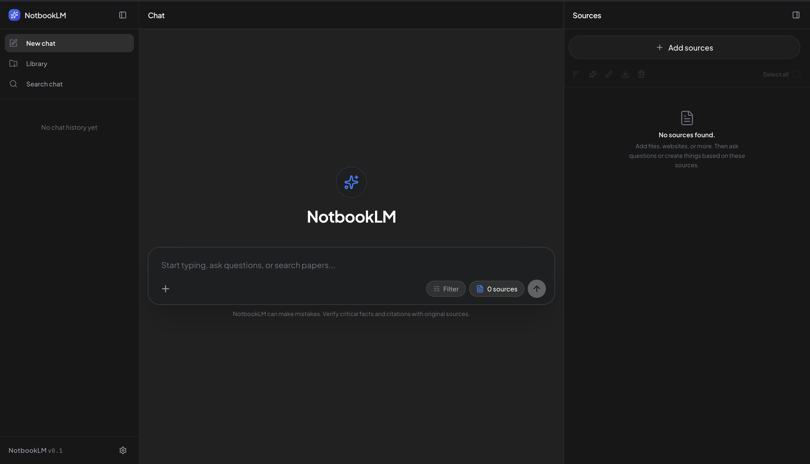
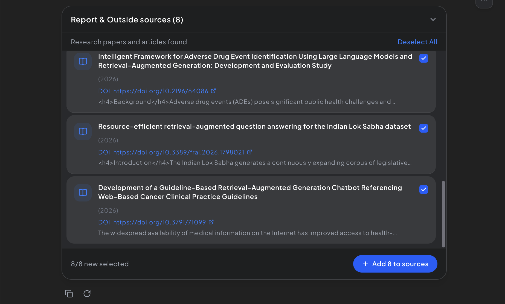
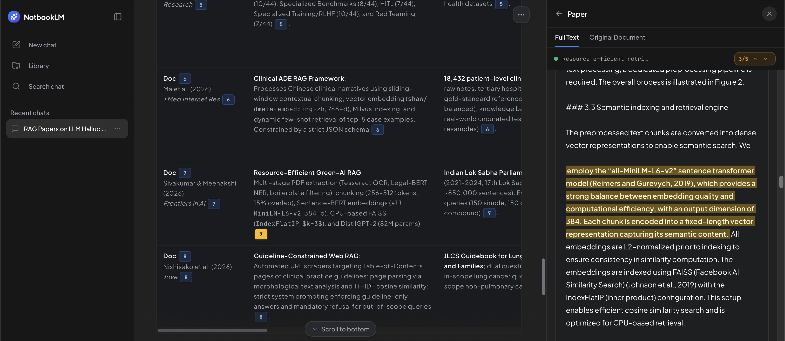

# NotbookLM



An open-source academic research assistant and document workspace designed to run locally on your own machine. Inspired by tools like Google Notebook / Gemini Notebook (previously NotebookLM), Consensus, and Elicit—NotbookLM bridges conversational AI with verifiable academic literature synthesis.

Instead of relying on proprietary cloud lock-in, NotbookLM operates locally by default—combining embedded relational storage (SQLite), in-process vector indexing (Qdrant), and local file processing. It streamlines retrieval, filtering, and synthesis of scholarly publications from global academic repositories—including **OpenAlex**, **Crossref**, and **Europe PMC**, with **DuckDuckGo** scholarly web search fallback, and full-text PDF resolution via **arXiv** and **Unpaywall**—delivering structured comparative matrices and grounded citations linked directly to source papers.

Internet connectivity is required out-of-the-box for live academic discovery, PDF resolution, and external LLM APIs. If you need a fully offline or private setup for self-uploaded documents, you can manually configure your own local inference stack—such as pointing `LLM_BASE_URL` to a local runner (e.g., Ollama, vLLM) and caching embedding weights locally.

### Highlights

* **Deterministic Workspace Citation Indexing:** Every document retains a fixed, immutable citation number (`1.`, `2.`, `3.`) across all turns of the conversation based on a deterministic ID-ascending contract. When a document is removed, the system cleanly rearranges remaining indices without numeric fragmentation.
* **Automated Literature Discovery & Web Fallback:** Queries global academic registries (**OpenAlex**, **Crossref**, and **Europe PMC**) with automatic **DuckDuckGo** web search fallback when academic registries yield sparse results, iterative candidate pool retrieval, language-aware filtering, and DOI/title deduplication.
* **Full-Text PDF & Metadata Resolution:** Locates and downloads open-access PDFs via concurrent racing resolvers (**arXiv**, **Unpaywall**, **OpenAlex**, **Europe PMC**) with in-memory title verification, while enriching paper records with journal quartiles and citation counts.
* **Multi-Format Ingestion & Bibliography Splitting:** Ingests PDF, DOCX, TXT, and Markdown files. Multi-entry BibTeX (`.bib`) and RIS (`.ris`) collections are automatically disassembled on upload into standalone workspace documents with optimistic loading spinners and real-time open-access PDF resolution.
* **Asynchronous Auto-Grounding & SQLite Persistence:** Citation grounding runs asynchronously after generation via Fast LLM and is persisted in SQLite (`citation_highlights`). A 4-tier matching engine (exact verbatim, n-gram intersection, fallback span, and multi-bullet context cursor) accurately highlights supporting passages in the document reader.
* **Cell-Level Citation Matrices & Markdown Export:** Synthesizes literature into structured comparative review matrices with verifiable citations embedded directly in individual table cells, accompanied by 1-click Markdown table copy and native KaTeX math equation rendering.
* **Interactive Split-Pane Reader & Jump-to-Highlight:** Bidirectional citation navigation—clicking any citation badge in a response or table cell automatically opens the document reader, scrolls to the page, and highlights the exact supporting passage.
* **Targeted Document Focus:** One-click "Ask about this document" mode focuses questions exclusively on an individual paper without deselecting other workspace files.
* **7-Format Citation Generator & Bulk ZIP Export:** Instant generation of verified academic citations in APA 7th, IEEE, Harvard, MLA 9th, Chicago, BibTeX, and RIS formats, alongside one-click bulk ZIP bundling for entire workspaces.
* **3-Tier Hybrid Metadata Extractor:** Handles user-uploaded documents (PDF, Word, Markdown, Text) via DOI auto-resolution, Crossref title matching, and a document inspector tailored for theses, dissertations, and institutional reports without fabricating false citations.
* **Benchmarked Literature Synthesis:** Evaluated across established open-source evaluation tools and research protocols (**RAGAS**, **DeepEval**, **TruLens**, **Promptfoo**, **LlamaIndex**, and **Princeton ALCE**) on a 75-case benchmark of authentic academic research papers (**AllenAI QASPER & SciFact**) balancing single-paper deep dives, multi-paper comparative synthesis across 2–4 documents, and biomedical claim verification, achieving a 0.953 Composite Consensus score (0.949 Groundedness and 0.923 Answer Relevancy).
* **Layered Conversational Memory & Elastic Token Budgeting:** Dynamic Priority Waterfall and Layered Memory Compaction (elastic token reclaim, non-destructive topic digest, and high-recall declarative sentence classification) that retains operational constraints, parameters, and research invariants verbatim in Pinned Working Memory. Empirically benchmarked on a 100-case Conversational NIAH matrix (Stanford RULER & Anthropic standards), achieving 98.0% needle retention on context-constrained 8K models (100% on multi-needle tracking and temporal rule updates).
* **Local-First & Multi-Role LLM Architecture:** Runs locally with embedded SQLite and Qdrant. Connects to any OpenAI-compatible API (Ollama, vLLM, DeepSeek, GPT-4o) with tiered primary, fast, and auto-fallback model roles, plus optional S3 storage (Cloudflare R2, MinIO).

---

## Workflow & Core Capabilities

### 1. Literature Discovery & Granular Ingestion
Search across OpenAlex, Crossref, and Europe PMC, with automated **DuckDuckGo** scholarly web search fallback for niche topics and recent preprints. NotbookLM screens candidate publications and presents actionable cards containing titles, publication years, DOI links, and abstract previews. Users can select candidates with tri-state selection controls, batch-import with live progress tracking (`Adding x/y...`), and cancel individual downloads granularly from the sidebar without leaving orphan files.



### 2. Deterministic Source Management & Multi-Format Ingestion
Imported and uploaded sources appear in the right-hand **Sources** panel with permanent numeric citation indices (`1.`, `2.`, ...):
* **Format Badges & Document Status:** Visual tags reflect source state—`PDF` (red) indicates an authentic manuscript PDF acquired via open-access resolvers, while `TXT` (gray) represents structured publication briefs with abstracts for paywalled references or uploaded text notes. Additional tags identify uploaded document formats like `DOC` (Word) and `MD` (Markdown).
* **Automated Bibliography Disassembly:** Uploading multi-entry `.bib` or `.ris` files automatically splits each reference into an individual workspace entry. Client-side title extraction creates instant optimistic loading cards with spinners while concurrent background racing attempts to resolve full open-access PDFs via DOI before falling back to structured publication briefs.
* **Deterministic Indices & Auto-Reindex:** A source's citation number remains consistent throughout the entire conversation. Deleting a source automatically compacts and shifts remaining document indices cleanly.
* **Verified Paper vs. Local Manuscript:** Authentic journal publications retain official publisher metadata, while local documents (such as theses, student projects, or CVs) are cleanly cataloged without artificial journal labels.
* **Bulk ZIP Export:** Download original documents individually or bundle multiple selected sources into a single organized ZIP package.

### 3. Integrated Document Reader & Targeted Focus
Inspect full manuscripts directly within the workspace:
* **Dual-View Inspection:** Stream authentic publication PDFs directly in the browser or switch to extracted full-text for citation navigation.
* **Ask About This Document:** Focus queries exclusively on a single source with one click, bypassing manual workspace deselection.
* **Multi-Format Citation Generator:** Export clean, verified academic citations across APA 7th, IEEE, Harvard, MLA 9th, Chicago, BibTeX, and RIS.

### 4. Grounded Synthesis & Bidirectional Citation Highlighting
Synthesize multiple papers into comparative review matrices. Each finding is tagged with traceable citation badges (`[1]`, `[2]`). Clicking any citation opens the document reader and automatically scrolls to highlight the exact supporting sentence in the source text:
* **Cell-Level Evidence:** Citations are anchored to specific table cells for verifiable metric-by-metric comparison.
* **4-Tier Highlight Matching:** Resolves citations using exact verbatim quotes, n-gram token intersection, character span fallback, and context cursors designed specifically for multi-bullet comparison tables.
* **Asynchronous Grounding & Persistence:** Fast LLM grounding runs asynchronously in the background and caches results directly in SQLite (`citation_highlights`), ensuring instant jump-to-highlight on return visits.
* **1-Click Table Copy (Hybrid Clipboard):** Copy sanitized tables directly into Microsoft Word, Google Docs, Notion, Obsidian, or Typora with automated dual-format tabular rendering (HTML grid + Markdown text).
* **KaTeX Mathematics:** Seamlessly renders mathematical notation, formulas, and matrices ($E = mc^2$, $\sum$, $\int$).



---

## Empirical Benchmarking & Evaluation

To evaluate retrieval, synthesis, and citation accuracy, NotbookLM is benchmarked against public research questions from peer-reviewed scientific datasets rather than ad-hoc queries.

Performance is audited across established open-source evaluation tools and research benchmark protocols on a **50-case scientific benchmark** (evaluated under deterministic greedy decoding `temperature=0.0`):
* **25 Single-Paper Deep Dives:** AllenAI QASPER test split (full-text 15–35 page arXiv papers with tables and empirical metrics).
* **15 Multi-Paper Comparative Synthesis:** Curated multi-document workspaces comparing 2–3 research papers in structured tables.
* **10 Biomedical Claim Verifications:** AllenAI SciFact claims testing evidence attribution and false-premise rejection.

### Production Scorecard (50-Case Multi-Paper Scientific Benchmark)

| Evaluation Dimension | Benchmark Score | Evaluator Breakdown & Methodology |
| :--- | :---: | :--- |
| **Groundedness (Anti-Hallucination)** | **0.949** | Continuous 4-judge mean: DeepEval (`0.985`) + TruLens (`0.942`) + Promptfoo (`0.957`) + RAGAS (`0.919`)* |
| **Answer Relevancy & Completeness** | **0.923** | Continuous 3-judge mean: DeepEval (`0.956`) + TruLens (`0.853`) + Promptfoo (`0.960`) |
| **Ground-Truth Correctness** | **0.976** | Dual-judge consensus: LlamaIndex + Promptfoo ground-truth alignment |
| **Citation Quality (Princeton ALCE)** | **Recall: 0.817 / Precision: 0.760** | Formal statement entailment & citation redundancy penalty *(EMNLP 2023)* |
| **Strict Binary Entailment (LlamaIndex)** | **0.720** *(36/50 passed)* | Zero-tolerance binary context entailment gate (36 passed, 14 failed; separated from continuous consensus) |
| **Composite Consensus Score** | **0.953** / 1.000 | Weighted summary index across continuous evaluation dimensions |

> **Benchmark Configuration & Model Roles:**  
> * **System Under Test (NotbookLM Core Pipeline):**  
>   * **Main LLM (`gemini-3.8-flash-high`):** Powers full-manuscript reading, multi-paper comparative synthesis tables, and grounded academic drafting.  
>   * **Fast LLM (`gemini-3.7-flash-low`):** Handles operational micro-tasks (on-demand citation highlight passage extraction, metadata inspection, and query intent classification).  
> * **Evaluator Judge (`gemini-3.1-pro-low`):** Assigned as the independent evaluation judge across all six evaluation tools and protocols (RAGAS, DeepEval, TruLens, Promptfoo, Princeton ALCE, and LlamaIndex) under greedy decoding (`temperature=0.0`).  
> * **Methodological Note on RAGAS ($N=38$):** RAGAS multi-statement atomic claim decomposition evaluates all 38 extractive QASPER cases. It is intentionally omitted on 2 unanswerable cases and 10 SciFact verification claims to prevent false penalties on negative abstention.  
> * **Reproducibility Note:** Decoding temperature is locked to `0.0` to maximize determinism. However, due to the inherent non-deterministic nature of LLM inference (provider-side GPU batching and dual-sided LLM-as-a-judge dynamics), replication runs may still exhibit slight score variations even when using the exact same model pairing. Running the benchmark with alternative backends (e.g. GPT-4o, Claude, or local open-weights models) will naturally yield distinct quantitative figures.

### Conversational Memory Scorecard (100-Case Needle-In-A-Haystack Matrix)

To evaluate conversational recall, instruction retention, and constraint preservation under progressive memory compression, NotbookLM is benchmarked across a custom **100-case Conversational Needle-In-A-Haystack (NIAH)** test matrix tailored specifically for research dialogues. The matrix evaluates four 25-case categories: Single-Fact Retrieval, Multi-Variable Tracking, Temporal Reasoning & Superseding Rules, and Negative Abstention Traps.

> **Dataset Clarification:** Unlike the RAG benchmark above (which uses external public datasets: AllenAI QASPER, SciFact, and Princeton ALCE citation protocol), this conversational NIAH matrix consists of synthetic test scenarios custom-built for this application to assess real-world conversational memory degradation, persona shifts, and token-budget compaction.

| Evaluation Category | Mode A (8K Context Cap / Layered Compaction) | Mode B (1M Native Context Ingestion) |
| :--- | :---: | :---: |
| **Overall Needle Accuracy (100 Cases)** | **0.980** *(98.0%)* | **0.950** *(95.0%)* |
| • **Single-Fact Retrieval** | **0.960** | 0.920 |
| • **Multi-Variable Tracking** | **1.000** | 1.000 |
| • **Temporal Reasoning & Superseding Rules** | **1.000** | 0.960 |
| • **Negative Abstention Traps** | **0.960** | 0.920 |

> **Note on Evaluation Modes:** Mode A evaluates the application's layered compaction pipeline (pinned directives, declarative facts, and conversation digests) constrained to an 8K budget. Mode B feeds the full conversational transcript directly without compaction into a 1M context window model. The high accuracy in Mode A reflects that compact, curated working context helps prevent the model from missing details across long conversational turns.

### Evaluation Tooling & Dataset References

#### Open-Source Evaluation Libraries & Tools
* **RAGAS** ([GitHub](https://github.com/explodinggradients/ragas)): Automated evaluation of retrieval-augmented generation pipelines using atomic claim decomposition and NLI — Es et al., *RAGAS: Automated Evaluation of Retrieval Augmented Generation*, EACL 2024.
* **DeepEval** ([GitHub](https://github.com/confident-ai/deepeval)): Production LLM evaluation harness utilizing G-Eval probabilistic metric modeling — Liu et al., *G-Eval: NLG Evaluation using GPT-4 with Better Human Alignment*, EMNLP 2023.
* **TruLens** ([GitHub](https://github.com/truera/trulens)): Systematic RAG Triad assessment measuring groundedness, context relevance, and answer relevance with Chain-of-Thought (CoT) reasoning — TruEra (2023).
* **Promptfoo** ([GitHub](https://github.com/promptfoo/promptfoo)): Test suite and assertion harness for model-graded continuous verification, regression testing, and negative abstention.
* **LlamaIndex Evaluation Core** ([Docs](https://docs.llamaindex.ai/en/stable/module_guides/evaluating/)): Native context entailment gatekeeping (`FaithfulnessEvaluator`) and semantic ground-truth correctness (`CorrectnessEvaluator`).

#### Benchmark Protocols & Research Datasets
* **Princeton ALCE Protocol** ([GitHub](https://github.com/princeton-nlp/ALCE)): Automatic LLM citation evaluation benchmark protocol measuring formal Citation Recall (statement support) and Citation Precision (redundancy check) — Gao et al., *Enabling Large Language Models to Generate Text with Citations*, EMNLP 2023.
* **AllenAI QASPER** ([Project](https://allenai.org/data/qasper)): Information-seeking questions and answers anchored in full-text arXiv research papers with human-annotated evidence — Dasigi et al., *A Dataset of Information-Seeking Questions and Answers Anchored in Research Papers*, ACL 2021.
* **AllenAI SciFact** ([Project](https://allenai.org/data/scifact)): Scientific claim verification benchmark based on biomedical literature with expert-labeled evidence and rationale sentences — Wadden et al., *Fact or Fiction: Verifying Scientific Claims with Evidence from Open Access Publications*, EMNLP 2020.

---

## Quickstart

You can run this project in two ways:

### Option 1: Quickstart via Docker
Runs all services in containers without requiring local Python or Node.js installations.

1. **Clone repository:**
   ```bash
   git clone https://github.com/ganendraditya/not-notebooklm.git
   cd not-notebooklm
   ```

2. **Setup environment variables:**
   ```bash
   cp backend/.env.example backend/.env
   ```
   *Configure your API key and model preferences in `backend/.env`.*

3. **Start services with Docker Compose:**
   ```bash
   docker compose up -d
   ```

4. **Access the application:**
   * **Frontend Web App:** `http://localhost:3000`
   * **Backend API Docs:** `http://localhost:8000/docs`
   * **Qdrant Dashboard:** `http://localhost:6333/dashboard`

---

### Option 2: Local Development (Bare-Metal)
For active development directly on your machine.

> **Bare-Metal Default Stack:**
> By default in bare-metal mode, NotbookLM operates on an embedded local stack:
> * **Relational Database:** SQLite (`backend/not_notebooklm.db`)
> * **Object Storage:** Local file system (`uploads/` and `uploads/chat_media/`)
> * **Vector Engine:** Embedded in-process Qdrant (`backend/qdrant_data/`)
>
> This default enables immediate local setup without running external services.
>
> **Production and Multi-User Setup:**
> For server deployments or multi-user environments:
> 1. **S3 Object Storage:** Set `STORAGE_TYPE=s3` in `backend/.env` to connect to Cloudflare R2 or MinIO. This ensures uploaded research papers and chat attachments persist across server restarts.
> 2. **Dedicated Vector Server:** Run a standalone Qdrant container (`docker run -d -p 6333:6333 qdrant/qdrant`) and configure `QDRANT_URL=http://localhost:6333` in `backend/.env` for independent indexing and lower backend memory usage.
> 3. **Docker Compose:** Alternatively, running `docker compose up -d` (Option 1) manages these services automatically.

#### 1. Initial Setup (Dependencies & Configuration)

**Backend:**
```bash
cd backend
python -m venv venv

# Windows
.\venv\Scripts\activate
# Linux / macOS
source venv/bin/activate

pip install -r requirements.txt
cp .env.example .env
# Edit backend/.env with your LLM configuration
cd ..
```

**Frontend:**
```bash
cd frontend
npm install
cd ..
```

#### 2. Start Servers

##### Recommended: One-Click Startup Script
Launch both backend and frontend servers simultaneously with a single command from the project root:

- **Linux / macOS:**
  ```bash
  ./start.sh
  ```
- **Windows (PowerShell):**
  ```powershell
  .\start.ps1
  ```

Both startup scripts include an integrated **Port Guard** that automatically detects and safely terminates orphaned processes on ports 8000 and 3000, preventing `Address already in use` launch errors.

##### Alternative: Manual Startup (Separate Terminals)
If you prefer running services in separate terminal windows for dedicated logs:
- **Backend:** `cd backend && source venv/bin/activate && uvicorn main:app --reload --port 8000` (or `.\venv\Scripts\activate` on Windows)
- **Frontend:** `cd frontend && npm run dev`

Open `http://localhost:3000` in your browser.

##### Pre-Flight Verification Script
Mirror the automated GitHub Actions CI pipeline locally before committing or creating pull requests:
```bash
./check.sh
```
Runs frontend linting, unit tests (`vitest`), Next.js production build, backend syntax compilation, and the full pytest suite. Flags: `--frontend` (`-f`) or `--backend` (`-b`) to run targeted checks.

---

## LLM Configuration

NotbookLM integrates with any OpenAI-compatible endpoint or gateway. Providers and models can be changed via environment variables without modifying application code.

### Core Variables (`backend/.env`)

```env
# 1. Endpoint & Authentication
LLM_BASE_URL=http://localhost:20128/v1
LLM_API_KEY=your_api_key_here

# 2. Model Roles
LLM_MODEL=gpt-4o
LLM_FAST_MODEL=gpt-4o-mini
LLM_FALLBACK_MODEL=gpt-4o-mini
```

### Model Roles

| Variable | Role | Necessity | Description |
| :--- | :--- | :--- | :--- |
| **`LLM_MODEL`** | Primary Model | **Required** | Handles complex tasks: multi-document synthesis, literature comparisons, grounded verbatim citations, and workspace analysis. |
| **`LLM_FAST_MODEL`** | Fast Model | *Optional* | Handles quick micro-tasks: query planning, user intent triage, paper relevance screening, and title generation.<br> *If omitted, the system defaults to `LLM_MODEL`.* |
| **`LLM_FALLBACK_MODEL`** | Fallback Model | *Optional* | Engages automatically if the primary model encounters rate limits (HTTP 429), timeouts, or service unavailability. |

---

## Storage Configuration (Local Disk & S3 Object Storage)

Files can be stored directly on the local disk or synced to an S3-compatible Object Storage provider (such as Cloudflare R2, MinIO, or AWS S3).

### Configuration (`backend/.env`)

#### Option 1: Local Disk Storage (Default)
```env
STORAGE_TYPE=local
```
Files are stored directly in `uploads/` and `uploads/chat_media/`.

#### Option 2: S3-Compatible Storage (Cloudflare R2, MinIO, AWS S3)
```env
STORAGE_TYPE=s3
S3_ENDPOINT_URL=https://<account_id>.r2.cloudflarestorage.com  # or http://localhost:9000 for MinIO
S3_ACCESS_KEY_ID=your_access_key_id
S3_SECRET_ACCESS_KEY=your_secret_access_key
S3_BUCKET_NAME=not-notebooklm
S3_REGION=auto  # or us-east-1
```

---

## Secret Management

Populate your credentials into `backend/.env`:
```bash
cp backend/.env.example backend/.env
```
The application reads configuration through standard environment variables. If you prefer managing credentials without plaintext `.env` files, `./start.sh` (Linux/macOS) and `.\start.ps1` (Windows) feature automatic CLI detection and parity for both [Doppler](https://www.doppler.com) and [Infisical](https://infisical.com) (auto-detects active vault sessions or supports explicit wrappers like `doppler run -- ./start.sh` or `infisical run -- ./start.sh`).

---

## Architecture & Tech Stack

* **Frontend:** Next.js 16 (App Router), React 19, Tailwind CSS, Zustand State Management, Base UI.
* **Backend:** FastAPI, SQLAlchemy (SQLite with WAL mode for chat sessions & citation persistence), LlamaIndex.
* **Literature Discovery:** Multi-engine scholarly search via **OpenAlex**, **Crossref**, **Europe PMC**, and **DuckDuckGo** web search fallback.
* **PDF Resolvers:** Concurrent racing resolvers across **arXiv**, **Unpaywall**, **OpenAlex**, and **Europe PMC** with in-memory title verification.
* **Storage:** Unified Storage Adapter supporting Local Disk and S3-compatible Object Storage (Cloudflare R2, MinIO, AWS S3).
* **Vector Store:** Qdrant (supports remote Docker instance or embedded local disk fallback).
* **Embeddings:** Local multilingual embeddings (`intfloat/multilingual-e5-small`) or Google Gemini embeddings.
* **LLM Engine:** OpenAI-compatible adapter (`OpenAILike`) with tiered model roles (Primary, Fast, Fallback) and automated error recovery.

### Repository Structure

```text
.
├── backend
│   ├── database.py              # SQLite + SQLAlchemy session manager with WAL mode
│   ├── evaluation               # Multi-framework scientific evaluation benchmark suite
│   │   ├── datasets             # Curated QASPER, SciFact, and multi-paper test suites
│   │   ├── metrics              # 6-framework metric adapters (ALCE, Ragas, TruLens, DeepEval)
│   │   └── run_benchmark.py     # Automated headless benchmark harness and consensus ledger
│   ├── main.py                  # FastAPI application entrypoint and middleware
│   ├── models.py                # Database models (chats, messages, documents, highlights)
│   ├── providers                # Academic registry and web search scrapers
│   │   ├── academic             # OpenAlex, Crossref, and Europe PMC registry clients
│   │   └── scrapers             # DuckDuckGo scholarly web search fallback scraper
│   ├── rag                      # Retrieval-Augmented Generation core engine
│   │   ├── academic_chunker.py  # Section-aware academic paper chunking
│   │   ├── engine.py            # Chat query dispatch and history pipeline
│   │   ├── intent.py            # Pure semantic intent classifier (Discovery vs Workspace)
│   │   ├── llm_factory.py       # Tiered model factory (Primary, Fast, Fallback)
│   │   ├── parsers.py           # Multi-format document parser (PDF, DOCX, TXT, MD)
│   │   ├── pipelines            # Workspace synthesis & comparative analysis pipelines
│   │   ├── prompts.py           # Strict language mirroring & zero-hallucination prompts
│   │   ├── search.py            # FlashRank reranker and reciprocal rank fusion
│   │   ├── token_budget.py      # Dynamic context budgeting and token waterfall
│   │   └── vector_store.py      # Qdrant client (embedded disk & remote server)
│   ├── routers                  # REST API endpoints (chats, documents, papers, storage)
│   ├── services                 # Business logic services
│   │   ├── document             # DOI resolution, deduplication, and file handlers
│   │   ├── export_service.py    # 7-format citation generator & bulk ZIP packager
│   │   ├── highlight_service.py # 4-tier citation highlight matching engine
│   │   └── storage_adapter.py   # Unified storage adapter (Local disk & S3/R2/MinIO)
│   └── tests                    # Backend pytest suite (unit & integration tests)
├── docs                         # Architectural documentation & evaluation methodology
├── frontend
│   ├── src
│   │   ├── app                  # Next.js 16 App Router (layout, page, providers)
│   │   ├── components           # Modular UI (Chat, Sources, DocumentReader, Search)
│   │   ├── hooks                # Custom React hooks (auto-scroll, shortcuts, resizers)
│   │   ├── lib                  # Formatting helpers, KaTeX renderer, and i18n
│   │   └── stores               # Zustand state stores (chatStore, searchStore, readerStore)
│   ├── package.json             # Frontend package metadata and dependencies
│   └── vitest.config.ts         # Vitest unit test configuration
├── check.sh                     # CI mirror pre-flight verification script (lint, test, build)
├── docker-compose.yml           # Multi-container orchestration (App + Qdrant)
├── start.sh                     # One-click startup script with port guard (Linux/macOS)
└── start.ps1                    # One-click startup script with port guard (Windows)
```

---

## License

MIT
