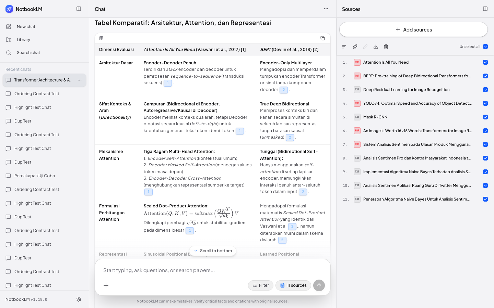
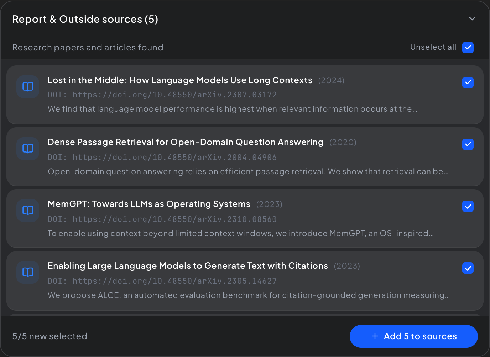
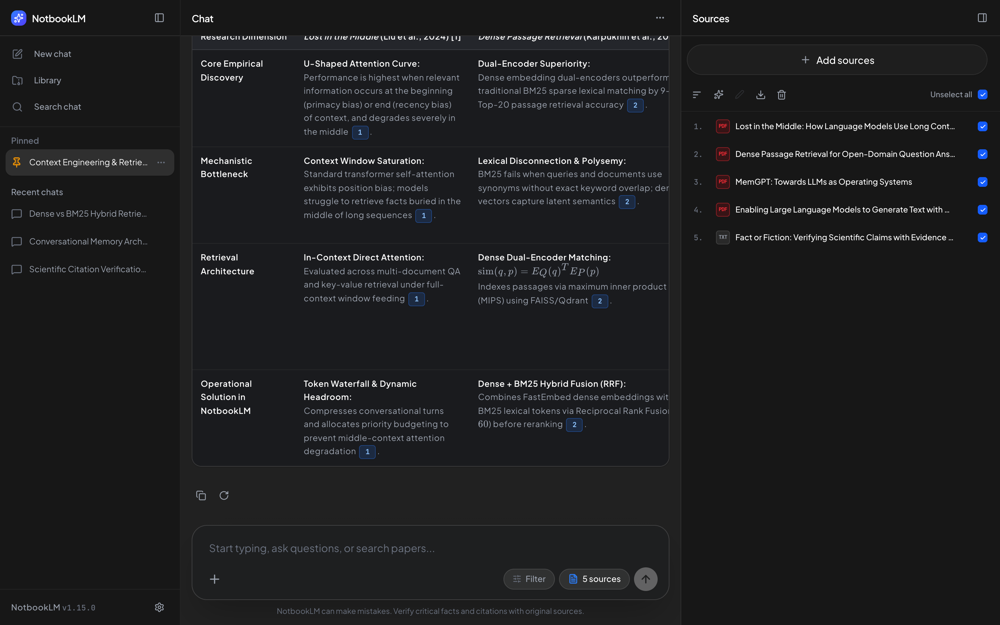
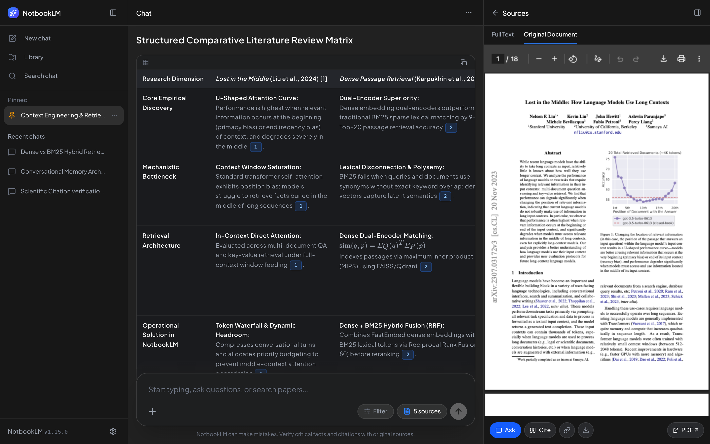
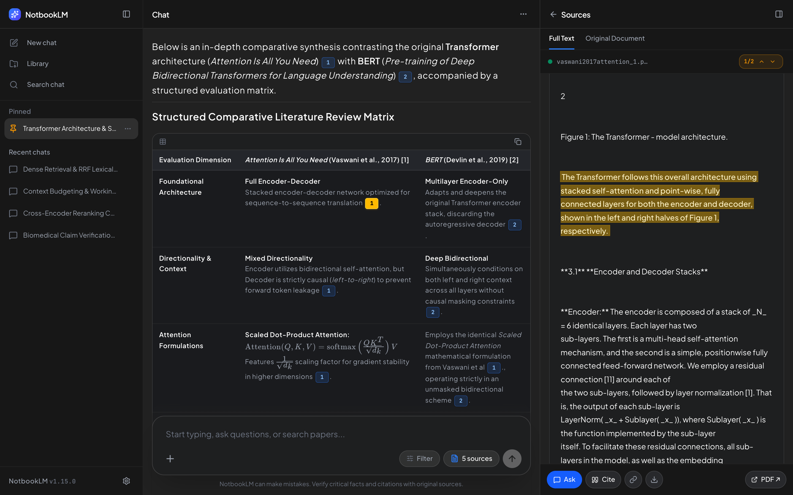

# NotbookLM



An open-source academic research assistant and document workspace designed to run locally on your own machine. Inspired by tools like Google Notebook / Gemini Notebook (previously NotebookLM), Consensus, and Elicit—NotbookLM bridges conversational AI with verifiable academic literature synthesis.

Instead of relying on proprietary cloud lock-in, NotbookLM operates locally by default—combining embedded relational storage (SQLite), in-process vector indexing (Qdrant), and local file processing. It streamlines retrieval, filtering, and synthesis of scholarly publications from global academic repositories—including **OpenAlex**, **Crossref**, and **Europe PMC**, with **DuckDuckGo** scholarly web search fallback, and full-text PDF resolution via **arXiv** and **Unpaywall**—delivering structured comparative matrices and grounded citations linked directly to source papers.

Internet connectivity is required out-of-the-box for live academic discovery, PDF resolution, and external LLM APIs. If you need a fully offline or private setup for self-uploaded documents, you can manually configure your own local inference stack—such as pointing `LLM_BASE_URL` to a local runner (e.g., Ollama, vLLM) and caching embedding weights locally.

### Highlights

* **Verifiable Citations & Instant Jump-to-Highlight:** Every finding and matrix cell is anchored to verifiable citations (`[1]`, `[2]`). Clicking any citation badge opens the integrated split-pane document reader, navigates to the exact page, and highlights the supporting passage.
* **Cell-Level Comparative Synthesis Matrices:** Synthesizes literature into structured comparative review tables with verifiable evidence anchored to individual cells, KaTeX mathematical notation, and 1-click clipboard export into Word, Google Docs, Notion, or Obsidian.
* **Automated Literature Discovery & Racing PDF Resolvers:** Screens scholarly registries (**OpenAlex**, **Crossref**, **Europe PMC**) with automatic **DuckDuckGo** web search fallback, concurrent racing resolvers for open-access PDFs (**arXiv**, **Unpaywall**), and automated multi-entry BibTeX/RIS disassembly.
* **Hardware-Friendly & Model-Agnostic (BYOK):** Runs locally by default with embedded relational storage (SQLite WAL) and in-process vector indexing (Qdrant) under a lightweight CPU-native footprint (~220MB initial weights, zero GPU dependencies out-of-the-box). Connects to any local runner (Ollama, vLLM) or external cloud gateway (DeepSeek, native Anthropic Claude direct, OpenAI).
* **Empirically Benchmarked Scientific Rigor:** Audited across 6 open-source evaluation frameworks (**RAGAS**, **DeepEval**, **TruLens**, **Promptfoo**, **LlamaIndex**, and **Princeton ALCE**) on authentic scientific datasets (**AllenAI QASPER & SciFact**) achieving a 0.900 Composite Consensus score and 98% Conversational Memory needle retention.

---

## Workflow & Core Capabilities

### 1. Literature Discovery & Granular Ingestion
Search across OpenAlex, Crossref, and Europe PMC, with automated **DuckDuckGo** scholarly web search fallback for niche topics and recent preprints. NotbookLM screens candidate publications and presents actionable cards containing titles, publication years, DOI links, and abstract previews. Users can select candidates with tri-state selection controls, batch-import with live progress tracking (`Adding x/y...`), and cancel individual downloads granularly from the sidebar without leaving orphan files.



### 2. Deterministic Source Management & Multi-Format Ingestion
Imported and uploaded sources appear in the right-hand **Sources** panel with permanent numeric citation indices (`1.`, `2.`, ...):
* **Format Badges & Document Status:** Visual tags reflect source state—`PDF` (red) indicates an authentic manuscript PDF acquired via open-access resolvers, while `TXT` (gray) represents structured publication briefs with abstracts for paywalled references or uploaded text notes. Additional tags identify uploaded document formats like `DOC` (Word) and `MD` (Markdown).
* **Automated Bibliography Disassembly:** Uploading multi-entry `.bib` or `.ris` files automatically splits each reference into an individual workspace entry. Client-side title extraction creates instant optimistic loading cards with spinners while concurrent background racing attempts to resolve full open-access PDFs via DOI before falling back to structured publication briefs.
* **Deterministic Indices & Auto-Reindex:** A source's citation number remains consistent throughout the entire conversation. Deleting a source automatically compacts and shifts remaining document indices cleanly.
* **Verified Paper vs. Local Manuscript:** Authentic journal publications retain official publisher metadata, while local documents (such as theses, student projects, or CVs) are cleanly cataloged without artificial journal labels.
* **Bulk ZIP Export:** Download original documents individually or bundle multiple selected sources into a single organized ZIP package.



> **Sorting Parity & Reference Index Integrity:**  
> * **Left Panel (Default Ingestion Order):** Displays sources in chronological upload order (`1.` to `5.`).  
> * **Right Panel (Reverse Alphabetical Sort / Title Z to A):** Demonstrates that re-ordering sources by title (`3.`, `1.`, `5.`, `4.`, `2.`) preserves each paper's permanent reference index (`1.`, `2.`, `3.`), preventing citation corruption across turns.

### 3. Integrated Document Reader & Targeted Focus
Inspect full manuscripts directly within the workspace:
* **Dual-View Inspection:** Stream authentic publication PDFs directly in the browser or switch to extracted full-text for citation navigation.
* **Ask About This Document:** Focus queries exclusively on a single source with one click, bypassing manual workspace deselection.
* **Multi-Format Citation Generator:** Export clean, verified academic citations across APA 7th, IEEE, Harvard, MLA 9th, Chicago, BibTeX, and RIS.



### 4. Grounded Synthesis & Bidirectional Citation Highlighting
Synthesize multiple papers into comparative review matrices. Each finding is tagged with traceable citation badges (`[1]`, `[2]`). Clicking any citation opens the document reader and automatically scrolls to highlight the exact supporting sentence in the source text:
* **Cell-Level Evidence:** Citations are anchored to specific table cells for verifiable metric-by-metric comparison.
* **4-Tier Highlight Matching:** Resolves citations using exact verbatim quotes, n-gram token intersection, character span fallback, and context cursors designed specifically for multi-bullet comparison tables.
* **Asynchronous Grounding & Persistence:** Fast LLM grounding runs asynchronously in the background and caches results directly in SQLite (`citation_highlights`), ensuring instant jump-to-highlight on return visits.
* **1-Click Table Copy (Hybrid Clipboard):** Copy sanitized tables directly into Microsoft Word, Google Docs, Notion, Obsidian, or Typora with automated dual-format tabular rendering (HTML grid + Markdown text).
* **KaTeX Mathematics:** Seamlessly renders mathematical notation, formulas, and matrices ($E = mc^2$, $\sum$, $\int$).



---

## Empirical Benchmarking & Evaluation

To evaluate retrieval, synthesis, and citation accuracy, NotbookLM is benchmarked against public research questions from peer-reviewed scientific datasets rather than ad-hoc queries.

Performance is audited across established open-source evaluation tools and research benchmark protocols on a **100-case scientific benchmark** (evaluated under deterministic greedy decoding `temperature=0.0`):
* **25 Single-Paper Deep Dives:** AllenAI QASPER test split (full-text 15–35 page arXiv papers with tables and empirical metrics).
* **15 Multi-Paper Comparative Synthesis:** Curated multi-document workspaces comparing 2–3 research papers in structured tables.
* **10 Biomedical Claim Verifications:** AllenAI SciFact claims testing evidence attribution and false-premise rejection.

### Production Scorecard (100-Case Multi-Paper Scientific Benchmark)

| Evaluation Dimension | Benchmark Score | Evaluator Breakdown & Methodology |
| :--- | :---: | :--- |
| **Groundedness (Anti-Hallucination)** | **0.876** | Continuous 4-judge mean: DeepEval (`0.998`) + TruLens (`0.916`) + Promptfoo (`0.932`) + Ragas (`0.828`) |
| **Answer Relevancy & Completeness** | **0.900** | Continuous 3-judge mean: DeepEval (`0.983`) + TruLens (`0.791`) + Promptfoo (`0.966`) |
| **Ground-Truth Correctness** | **0.871** | Dual-judge consensus: LlamaIndex + Promptfoo ground-truth alignment |
| **Citation Quality (Princeton ALCE)** | **Recall: 0.938 / Precision: 0.957** | Formal statement entailment & citation redundancy penalty *(EMNLP 2023)* |
| **Product Invariant: PDF Citation Fidelity** | **100.0%** *(1.000)* | Deterministic Substring & Fuzzy Match on physical source PDF |
| **Strict Binary Entailment (LlamaIndex)** | **0.780** *(78/100 passed)* | Zero-tolerance binary context entailment gate (separated from continuous consensus) |
| **Composite Consensus Score** | **0.900** / 1.000 | Weighted summary index across continuous evaluation dimensions |

> **Benchmark Configuration & Model Roles:**  
> * **System Under Test (NotbookLM Core Pipeline):**  
>   * **Main LLM (`gemini-3.8-flash-high`):** Powers full-manuscript reading, multi-paper comparative synthesis tables, and grounded academic drafting.  
>   * **Fast LLM (`gemini-3.7-flash-low`):** Handles operational micro-tasks (on-demand citation highlight passage extraction, metadata inspection, and query intent classification).  
> * **Evaluator Judge (`gemini-3.1-pro-low`):** Assigned as the independent evaluation judge across all six evaluation tools and protocols (RAGAS, DeepEval, TruLens, Promptfoo, Princeton ALCE, and LlamaIndex) under greedy decoding (`temperature=0.0`).  
> * **Methodological Note on RAGAS ($N=38$):** RAGAS multi-statement atomic claim decomposition evaluates all 38 extractive QASPER cases. It is intentionally omitted on 2 unanswerable cases and 10 SciFact verification claims to prevent false penalties on negative abstention.  
> * **Reproducibility Note:** Decoding temperature is locked to `0.0` to maximize determinism. However, due to the inherent non-deterministic nature of LLM inference (provider-side GPU batching and dual-sided LLM-as-a-judge dynamics), replication runs may still exhibit slight score variations even when using the exact same model pairing. Running the benchmark with alternative backends (e.g. GPT-4o, Claude, or local open-weights models) will naturally yield distinct quantitative figures.

### Conversational Memory Scorecard (100-Case Needle-In-A-Haystack Matrix)

To evaluate conversational recall, instruction retention, and constraint preservation under progressive memory compression, NotbookLM is benchmarked across a custom **100-case Conversational Needle-In-A-Haystack (NIAH)** test matrix tailored specifically for research dialogues. The matrix evaluates four 25-case categories: Single-Fact Retrieval, Multi-Variable Tracking, Temporal Reasoning & Superseding Rules, and Negative Abstention Traps.

> **Dataset Clarification:** Unlike the RAG benchmark above (which uses external public datasets: AllenAI QASPER, SciFact, and Princeton ALCE citation protocol), this conversational NIAH matrix consists of synthetic test scenarios custom-built for this application to assess real-world conversational memory degradation, persona shifts, and token-budget compaction.

| Evaluation Category | Mode A (8K Context Cap / Layered Compaction) | Mode B (1M Native Context Ingestion) |
| :--- | :---: | :---: |
| **Overall Needle Accuracy (100 Cases)** | **0.980** *(98.0%)* | **0.950** *(95.0%)* |
| • **Single-Fact Retrieval** | **0.960** | 0.920 |
| • **Multi-Variable Tracking** | **1.000** | 1.000 |
| • **Temporal Reasoning & Superseding Rules** | **1.000** | 0.960 |
| • **Negative Abstention Traps** | **0.960** | 0.920 |

> **Note on Evaluation Modes:** Mode A evaluates the application's layered compaction pipeline (pinned directives, declarative facts, and conversation digests) constrained to an 8K budget. Mode B feeds the full conversational transcript directly without compaction into a 1M context window model. The high accuracy in Mode A reflects that compact, curated working context helps prevent the model from missing details across long conversational turns.

### Evaluation Tooling & Dataset References

#### Open-Source Evaluation Libraries & Tools
* **RAGAS** ([GitHub](https://github.com/explodinggradients/ragas)): Automated evaluation of retrieval-augmented generation pipelines using atomic claim decomposition and NLI — Es et al., *RAGAS: Automated Evaluation of Retrieval Augmented Generation*, EACL 2024.
* **DeepEval** ([GitHub](https://github.com/confident-ai/deepeval)): Production LLM evaluation harness utilizing G-Eval probabilistic metric modeling — Liu et al., *G-Eval: NLG Evaluation using GPT-4 with Better Human Alignment*, EMNLP 2023.
* **TruLens** ([GitHub](https://github.com/truera/trulens)): Systematic RAG Triad assessment measuring groundedness, context relevance, and answer relevance with Chain-of-Thought (CoT) reasoning — TruEra (2023).
* **Promptfoo** ([GitHub](https://github.com/promptfoo/promptfoo)): Test suite and assertion harness for model-graded continuous verification, regression testing, and negative abstention.
* **LlamaIndex Evaluation Core** ([Docs](https://docs.llamaindex.ai/en/stable/module_guides/evaluating/)): Native context entailment gatekeeping (`FaithfulnessEvaluator`) and semantic ground-truth correctness (`CorrectnessEvaluator`).

#### Benchmark Protocols & Research Datasets
* **Princeton ALCE Protocol** ([GitHub](https://github.com/princeton-nlp/ALCE)): Automatic LLM citation evaluation benchmark protocol measuring formal Citation Recall (statement support) and Citation Precision (redundancy check) — Gao et al., *Enabling Large Language Models to Generate Text with Citations*, EMNLP 2023.
* **AllenAI QASPER** ([Project](https://allenai.org/data/qasper)): Information-seeking questions and answers anchored in full-text arXiv research papers with human-annotated evidence — Dasigi et al., *A Dataset of Information-Seeking Questions and Answers Anchored in Research Papers*, ACL 2021.
* **AllenAI SciFact** ([Project](https://allenai.org/data/scifact)): Scientific claim verification benchmark based on biomedical literature with expert-labeled evidence and rationale sentences — Wadden et al., *Fact or Fiction: Verifying Scientific Claims with Evidence from Open Access Publications*, EMNLP 2020.

---

## Quickstart & Installation

Choose the setup option that best matches your workflow:

### Option 1: Terminal Installer & CLI (Recommended for End-Users)
Installs NotbookLM locally with an isolated runtime environment and an interactive first-run setup wizard:

```bash
curl -fsSL https://raw.githubusercontent.com/ganendraditya/not-notebooklm/main/install.sh | bash
```

Once installed, launch the application anytime from any directory:
```bash
notbooklm
```
Opens the interactive start menu to launch the workspace, inspect logs, or manage background services.

* **Check running processes & ports:** `notbooklm status`
* **Open Control Dashboard directly:** `notbooklm admin`
* **Check or install updates:** `notbooklm update`
* **Stop background services:** `notbooklm stop`

---

### Option 2: Docker Compose (Isolated Containers)
Runs all services in pre-configured containers without requiring local Python or Node.js installations on your host machine:

1. **Clone repository and enter project directory:**
   ```bash
   git clone https://github.com/ganendraditya/not-notebooklm.git
   cd not-notebooklm
   ```

2. **Configure environment:**
   ```bash
   cp backend/.env.example backend/.env
   # Configure your API key or model preferences in backend/.env
   ```

3. **Start services:**
   ```bash
   docker compose up -d
   ```

* **Frontend Web App:** `http://localhost:3000`
* **Control Dashboard:** `http://localhost:3000/admin` (or port 2027 in bare-metal mode)
* **Backend API Docs:** `http://localhost:8000/docs`
* **Qdrant Dashboard:** `http://localhost:6333/dashboard`

---

### Option 3: Local Clone & Bare-Metal Development (For Developers & Contributors)
Ideal if you want to inspect, debug, or contribute code directly with live hot-reloading.

#### 1. Clone & Enter Project Root
First, clone the repository and navigate into the root directory:
```bash
git clone https://github.com/ganendraditya/not-notebooklm.git
cd not-notebooklm
```

#### 2. Install Dependencies & Setup Environment

**Backend Environment:**
```bash
cd backend
python3 -m venv venv

# Activate virtual environment:
# - Linux / macOS:
source venv/bin/activate
# - Windows (PowerShell):
.\venv\Scripts\activate

# Install dependencies (FastEmbed ONNX, FlashRank, FastAPI):
pip install -r requirements.txt
cp .env.example .env
cd ..
```

**Frontend Environment:**
```bash
cd frontend
npm install
cd ..
```

#### 3. Start Servers

You can start the development servers using either the automated one-click developer runner or separate terminal windows:

##### Method A: One-Click Dev Runner (Recommended)
From the project root (`not-notebooklm`), execute the startup script corresponding to your operating system. It features an integrated **Port Guard** (safely cleans stale processes on ports 8000/3000) and streams live console logs directly to your terminal:

- **Linux / macOS:**
  ```bash
  cd not-notebooklm
  ./start.sh
  ```
- **Windows (PowerShell):**
  ```powershell
  cd not-notebooklm
  .\start.ps1
  ```
Press `Ctrl+C` in the terminal to gracefully stop both servers.

##### Method B: Separate Terminals (Dedicated Logs)
If you prefer dedicated terminal windows for backend and frontend logs:

* **Terminal 1 (Backend API):**
  ```bash
  cd not-notebooklm/backend
  source venv/bin/activate       # Windows: .\venv\Scripts\activate
  uvicorn main:app --reload --port 8000
  ```
* **Terminal 2 (Frontend App):**
  ```bash
  cd not-notebooklm/frontend
  npm run dev
  ```

Open `http://localhost:3000` for the workspace, and `http://localhost:3000/admin` (or port 2027) for the Control Dashboard.

##### Pre-Flight Verification Script
Mirror the automated GitHub Actions CI pipeline locally before committing or creating pull requests:
```bash
./check.sh
```
Runs frontend linting, unit tests (`vitest`), Next.js production build, backend syntax compilation, and the full pytest suite. Flags: `--frontend` (`-f`) or `--backend` (`-b`) to run targeted checks.

---

## System Configuration: In-App Dashboard or .env

NotbookLM supports two configuration workflows:

### 1. In-App Control Dashboard (Visual Web UI)
For quick setup without manually editing plaintext files, open the **Control Dashboard** at `http://localhost:3000/admin` (or `http://localhost:2027` in bare-metal mode, or run `notbooklm admin`):
* **Universal Gateway Vault:** Add, edit, test, and delete OpenAI-compatible endpoints (DeepSeek, Grok, Ollama, Groq, vLLM) or direct native Anthropic Claude protocol with instant per-provider saving.
* **Tiered Routing:** Bind Primary Heavy, Fast Micro, and Fallback models to distinct gateway profiles with zero layout-shift diagnostic latency testing.
* **Retrieval & Reranker Manager:** Select between CPU FastEmbed ONNX (MiniLM-L12 or Multilingual E5-Large), universal `/v1/embeddings`, Google Gemini (3072-dim), or custom disk paths, plus FlashRank cross-encoder context cutoff adjustments (`top_n`).
* **Storage & Secrets:** Switch between local disk and S3/R2/MinIO object storage, or connect Doppler / Infisical secret vaults.

### 2. File-Based Configuration (`backend/.env`)
For headless servers, automated environments, or Docker containers, configure environment variables directly in `backend/.env`.

NotbookLM integrates with any OpenAI-compatible endpoint or native Anthropic Claude direct gateway. Providers and models can be changed via environment variables without modifying application code.

### Core Variables (`backend/.env`)

```env
# 1. Endpoint & Authentication
LLM_BASE_URL=http://localhost:20128/v1
LLM_API_KEY=your_api_key_here

# 2. Model Roles
LLM_MODEL=gpt-4o
LLM_FAST_MODEL=gpt-4o-mini
LLM_FALLBACK_MODEL=gpt-4o-mini
```

### Model Roles

| Variable | Role | Necessity | Description |
| :--- | :--- | :--- | :--- |
| **`LLM_MODEL`** | Primary Model | **Required** | Handles complex tasks: multi-document synthesis, literature comparisons, grounded verbatim citations, and workspace analysis. |
| **`LLM_FAST_MODEL`** | Fast Model | *Optional* | Handles quick micro-tasks: query planning, user intent triage, paper relevance screening, and title generation.<br> *If omitted, the system defaults to `LLM_MODEL`.* |
| **`LLM_FALLBACK_MODEL`** | Fallback Model | *Optional* | Engages automatically if the primary model encounters rate limits (HTTP 429), timeouts, or service unavailability. |

---

## Storage Configuration (Local Disk & S3 Object Storage)

Files can be stored directly on the local disk or synced to an S3-compatible Object Storage provider (such as Cloudflare R2, MinIO, or AWS S3).

### Configuration (`backend/.env`)

#### Option 1: Local Disk Storage (Default)
```env
STORAGE_TYPE=local
```
Files are stored directly in `uploads/` and `uploads/chat_media/`.

#### Option 2: S3-Compatible Storage (Cloudflare R2, MinIO, AWS S3)
```env
STORAGE_TYPE=s3
S3_ENDPOINT_URL=https://<account_id>.r2.cloudflarestorage.com  # or http://localhost:9000 for MinIO
S3_ACCESS_KEY_ID=your_access_key_id
S3_SECRET_ACCESS_KEY=your_secret_access_key
S3_BUCKET_NAME=not-notebooklm
S3_REGION=auto  # or us-east-1
```

---

## Secret Management

Populate your credentials into `backend/.env`:
```bash
cp backend/.env.example backend/.env
```
The application reads configuration through standard environment variables. If you prefer managing credentials without plaintext `.env` files, `./start.sh` (Linux/macOS) and `.\start.ps1` (Windows) feature automatic CLI detection and parity for both [Doppler](https://www.doppler.com) and [Infisical](https://infisical.com) (auto-detects active vault sessions or supports explicit wrappers like `doppler run -- ./start.sh` or `infisical run -- ./start.sh`).

---

## Architecture & Tech Stack

* **Frontend:** Next.js 16 (App Router), React 19, Tailwind CSS, Zustand State Management, Base UI.
* **Backend:** FastAPI, SQLAlchemy (SQLite with WAL mode for chat sessions & citation persistence), LlamaIndex.
* **Literature Discovery:** Multi-engine scholarly search via **OpenAlex**, **Crossref**, **Europe PMC**, and **DuckDuckGo** web search fallback.
* **PDF Resolvers:** Concurrent racing resolvers across **arXiv**, **Unpaywall**, **OpenAlex**, and **Europe PMC** with in-memory title verification.
* **Storage:** Unified Storage Adapter supporting Local Disk and S3-compatible Object Storage (Cloudflare R2, MinIO, AWS S3).
* **Vector Store:** Qdrant (supports remote Docker instance or embedded local disk fallback with automatic schema capability detection).
* **Embeddings:** Native CPU-optimized local multilingual dense embeddings (`sentence-transformers/paraphrase-multilingual-MiniLM-L12-v2` via FastEmbed ONNX, Zero-PyTorch) + FastEmbed BM25 sparse lexical tokens with Reciprocal Rank Fusion (RRF), alongside Google Gemini cloud embeddings (`models/gemini-embedding-001`, 3072 dim).
* **Cross-Encoder Reranker:** FlashRank (`ms-marco-TinyBERT-L-2-v2`, sub-10ms in-memory ONNX singleton).
* **LLM Engine:** OpenAI-compatible adapter (`OpenAILike`) with tiered model roles (Primary, Fast, Fallback) and automated error recovery.

### Repository Structure

```text
.
├── backend
│   ├── cli                      # Consumer CLI engine and interactive setup wizard
│   ├── database.py              # SQLite + SQLAlchemy session manager with WAL mode
│   ├── evaluation               # Multi-framework scientific evaluation benchmark suite
│   │   ├── datasets             # Curated QASPER, SciFact, and multi-paper test suites
│   │   ├── metrics              # 6-framework metric adapters (ALCE, Ragas, TruLens, DeepEval)
│   │   └── run_benchmark.py     # Automated headless benchmark harness and consensus ledger
│   ├── main.py                  # FastAPI application entrypoint and middleware
│   ├── models.py                # Database models (chats, messages, documents, highlights)
│   ├── providers                # Academic registry and web search scrapers
│   │   ├── academic             # OpenAlex, Crossref, and Europe PMC registry clients
│   │   └── scrapers             # DuckDuckGo scholarly web search fallback scraper
│   ├── rag                      # Retrieval-Augmented Generation core engine
│   │   ├── academic_chunker.py  # Section-aware academic paper chunking
│   │   ├── engine.py            # Chat query dispatch and history pipeline
│   │   ├── intent.py            # Pure semantic intent classifier (Discovery vs Workspace)
│   │   ├── llm_factory.py       # Tiered model factory (Primary, Fast, Fallback)
│   │   ├── parsers.py           # Multi-format document parser (PDF, DOCX, TXT, MD)
│   │   ├── pipelines            # Workspace synthesis & comparative analysis pipelines
│   │   ├── prompts.py           # Strict language mirroring & zero-hallucination prompts
│   │   ├── search.py            # FlashRank reranker and reciprocal rank fusion
│   │   ├── token_budget.py      # Dynamic context budgeting and token waterfall
│   │   └── vector_store.py      # Qdrant client (embedded disk & remote server)
│   ├── routers                  # REST API endpoints (chats, documents, papers, storage)
│   ├── services                 # Business logic services
│   │   ├── document             # DOI resolution, deduplication, and file handlers
│   │   ├── export_service.py    # 7-format citation generator & bulk ZIP packager
│   │   ├── highlight_service.py # 4-tier citation highlight matching engine
│   │   └── storage_adapter.py   # Unified storage adapter (Local disk & S3/R2/MinIO)
│   └── tests                    # Backend pytest suite (unit & integration tests)
├── docs                         # Architectural documentation & evaluation methodology
├── frontend
│   ├── src
│   │   ├── app                  # Next.js 16 App Router (layout, page, providers)
│   │   ├── components           # Modular UI (Chat, Sources, DocumentReader, Search)
│   │   ├── hooks                # Custom React hooks (auto-scroll, shortcuts, resizers)
│   │   ├── lib                  # Formatting helpers, KaTeX renderer, and i18n
│   │   └── stores               # Zustand state stores (chatStore, searchStore, readerStore)
│   ├── package.json             # Frontend package metadata and dependencies
│   └── vitest.config.ts         # Vitest unit test configuration
├── bin
│   └── notbooklm                # Unified CLI executable wrapper
├── check.sh                     # CI mirror pre-flight verification script (lint, test, build)
├── docker-compose.yml           # Multi-container orchestration (App + Qdrant)
├── install.sh                   # One-line consumer terminal installer
├── start.sh                     # One-click startup script with port guard (Linux/macOS)
└── start.ps1                    # One-click startup script with port guard (Windows)
```

---

## License

MIT
